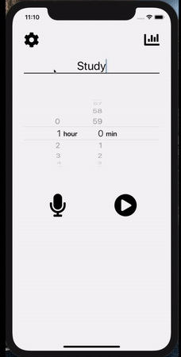

# Get-it-done Timer

## Introduction
I made this timer as there was no iOS timer app on the market that precisely satisfied my needs.

### Why was I unhappy with the existing timer apps?

- Some were **too simple**, and didn't offer spent-hour tracking (iPhone default Timer),
- Some were **not customisable** (e.g. many Pomodoro timers, which can only be set for 25 minutes or 50 minutes for each session)
- And no timer offered **synchronization** with iPhone's default **Apple Calendar** app, which I use to manage my daily schedule.

### So I made a timer which,
- is insanely **simple**,
- can **track** how many hours I spent per category per day,
- can encourage me to **focus**
- can automatically sync with **Apple Calendar**
- can start timer using voice recognition

## Download here

## Setup this project on computer
### Requirements
- To set up on your laptop, you need
    - `Mac OS`
    - `Xcode` (the project was built on 11.4), to run the iOS Simulator

### Steps
- Clone this repo
- `$ npm install`
- Install Cocoa Pods using `$ sudo gem install cocoapods` (See http://cocoapods.org)
- `$ cd ios && pod install`
- `$ npm run ios` to run iOS simulator.

## Challenges
- React-native Libraries
    - Installing `node-nlp-rn` wasn't easy.
    - Library setup - I needed to configure iOS Swift files (not too crazy, but still taking time)
    - Errors in library (e.g. datetimepicker countdown mode)
- Mobile Specific issues
    - Permission issues
        - I needed to think of many cases (e.g. turn off all calendar related features, when user rejects calendar permission)
    - Background & setTimeout did not work
        - iPhone turned off an app in the background after 30 seconds
        - Logic needed to be changed according to this
    - Failed to mimick 'Hey Siri' 
        - The initial plan was to make an app wait for a trigger word (e.g. "Hey Timer" when the app is on)
        - There was a 1 minute limit on iOS voice recognition feature
        - I could have force re-running voice recognition, but didn't apply it, to pass Apple App Store reviews.
- Build issues
    - Creating apple developer account
    - xcode settings
    - App store connect test flight crash
        - Solved after running `expo publish`
- etc
    - AsyncStorage 
        - Saves & returns only JSON format (always need to be parsed)
        - Keep forgetting about this, and often is not easy to debug
